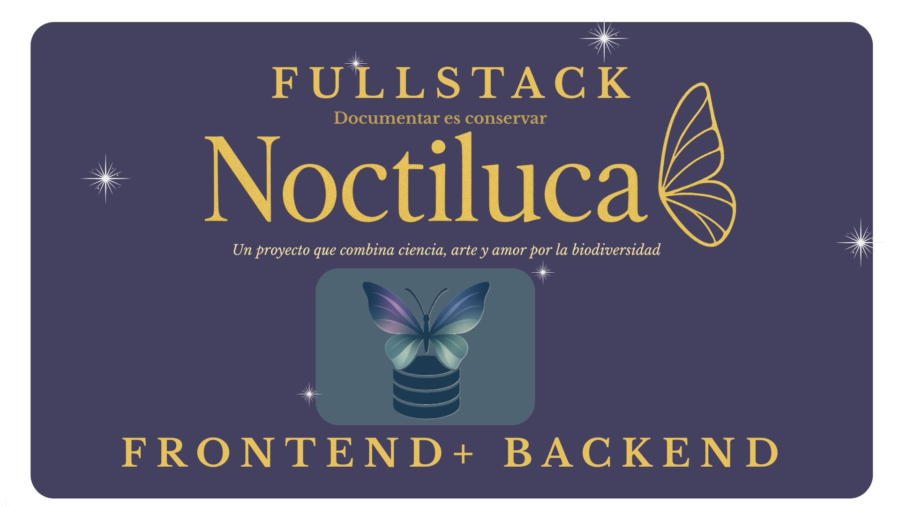

<p align="center">
  
</p>

## 🐛 Presentación

Noctiluca es una aplicación web interactiva pensada para explorar, aprender y valorar la biodiversidad de polinizadores en diferentes continentes.

Esta primera edición se centra en Europa y ha sido desarrollada como parte de un proyecto colaborativo en un bootcamp de Desarrollo Fullstack + DevOps.

🌍 Descubre mariposas de Europa en un entorno visual, educativo y accesible.

## 📂 Estructura del Proyecto

📦 fullstack-noctiluca-mysql
├── api-noctiluca-backend/   # Backend con Node.js, Express y Sequelize
│   ├── assets/              # Imágenes usadas en README (cover, postman, etc.)
│   ├── config/              # Configuración general
│   ├── controllers/         # Lógica de negocio
│   ├── database/            # Conexión a MySQL
│   ├── middlewares/         # Validaciones
│   ├── models/              # Modelos Sequelize
│   ├── routes/              # Endpoints de la API
│   ├── tests/               # Tests con Jest + Supertest
│   ├── .env                 # Variables de entorno (dev)
│   ├── .env.test            # Variables de entorno (test)
│   ├── app.js               # Configuración principal de Express
│   ├── server.js            # Arranque del servidor
│   └── package.json
│
└── Noctiluca-client/        # Frontend con React
    ├── public/
    ├── server/
    ├── src/
    │   ├── assets/
    │   ├── components/
    │   ├── layout/
    │   ├── pages/
    │   ├── router/
    │   ├── services/
    │   ├── style/
    │   └── test/
    ├── index.html
    ├── package.json
    └── vite.config.js

## ⚙️ Configuración

### 1️⃣ Clonar repositorio

git clone https://github.com/API-Noctiluca/fullstack-noctiluca-mysql.git
cd fullstack-noctiluca-mysql

2️⃣ Instalar dependencias
npm install

3️⃣ Iniciar servidor
🐛 En nuestr aterminar levantamos primero nuestro backend 
cd api-noctiluca-backend 
npm run dev

🐛 Luego en otra terminal levantamos nuestro front 
cd Noctiluca-client
npm run dev

🦋 Servidor corriendo en:
👉 http://localhost:5173/


## 🗄️ Base de Datos

La base de datos se gestiona con **MySQL + Sequelize**.  
Incluye el modelo principal `ButterflyModel`.


## 🛠️ Tecnologías utilizadas

**🔹 Frontend**

🦋 React
🦋 React Router
🦋 React Hook Form
🦋 Cloudinary
 (gestión de imágenes)
🦋 Vitest
 (testing)
🦋 CSS Modules
🦋 Tailwind 

**🔹 Backend**

🐛 Node.js
🐛 Express
🐛 Sequelize
🐛 MySQL
🐛 Jest + Supertest
 (testing)


## 🧪 Testing

Se usa **Jest + Supertest** para pruebas unitarias y de integración.

### Ejecutar tests
```bash
Ejemplo de test

test('GET /butterflies should return array', async () => {
  const response = await request(app).get("/api/butterflies");
  expect(response.status).toBe(200);
  expect(response.body).toBeInstanceOf(Array);
});
```
## 📬 Endpoints

### 👉 GET all butterflies
```
GET /api/butterflies
```
--- 
### 👉 GET one butterfly
```
GET /api/butterflies/:id
```
---
### 👉 POST create butterfly
```
POST /api/butterflies
```
---
### 👉 Body (JSON)
```
{
  "name": "Papilio machaon",
  "family": "Papilionidae",
  "location": "Europa",
  "habitat": "Praderas",
  "morphology": "Alas amarillas con manchas negras",
  "life": "1 año",
  "feeding": "Néctar",
  "conservation": "Protegida",
  "about_conservation": "LC",
  "image": "machaon.jpg"
}
```
---
### 👉 PUT update butterfly
```
PUT /api/butterflies/:id
```
---
### 👉 DELETE butterfly
```
DELETE /api/butterflies/:id
```
---
## 💻 Ejemplos CURL
### 👉 GET all
```
curl -X GET http://localhost:4000/api/butterflies
```
---
## 👉 POST create
```
curl -X POST http://localhost:4000/api/butterflies \
-H "Content-Type: application/json" \
-d '{
  "name": "Papilio machaon",
  "family": "Papilionidae",
  "location": "Europa",
  "habitat": "Praderas",
  "morphology": "Alas amarillas con manchas negras",
  "life": "1 año",
  "feeding": "Néctar",
  "conservation": "Protegida",
  "about_conservation": "LC",
  "image": "machaon.jpg"
}'
```
---
## 🌐 Documentación Postman

Consulta toda la documentación de la API haciendo clic en el logo:

<div align="center">
  <a href="https://documenter.getpostman.com/view/46421388/2sB3HnJKMj" target="_blank">
    
  </a>
</div>

---

## 📦 Próximas mejoras
🔍 Buscador de especies por nombre o país.

📊 Estadísticas visuales sobre biodiversidad.

🌐 Traducción multilingüe (i18n).

🔒 Autenticación y perfiles de usuario.


## ✨👩‍💻 Créditos Frontend 


Proyecto realizado por:

- Nicole Guevara  | Scrum Master & Developer
- Mariana Moreno| Product Owner & Developer
- Esther Tapias  |  Developer
- Rocío Coronel  |  Developer
- Valentina Montilla  |  Developer
- Maryori Cruz   |  Developer

## ✨👩‍💻 Créditos Backend 

Proyecto realizado por:

- Aday Alvarez | Scrum Master & Developer
- Nicole Guevara | Product Owner & Developer
- Mariany De Araujo |  Developer
- Guissella Perez |  Developer
- Julia Zarco  |  Developer


>“Noctiluca” significa luz nocturna, como la bioluminiscencia en el océano o el brillo sutil de los insectos en la oscuridad. Queremos que esta app sea una chispa de conocimiento que ilumine la importancia de los polinizadores en Europa.
